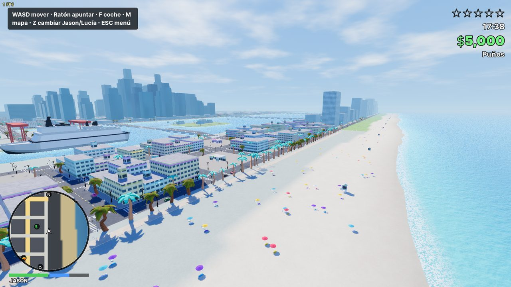
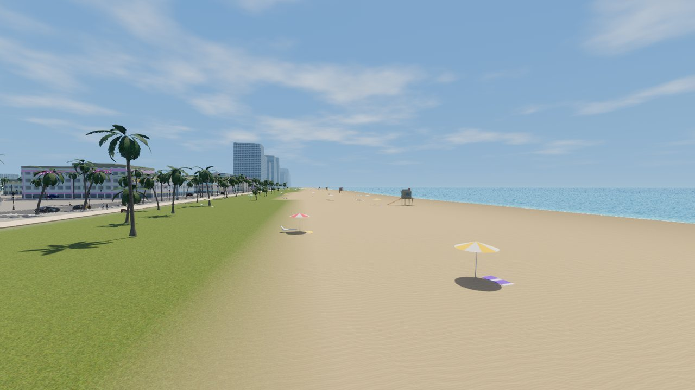
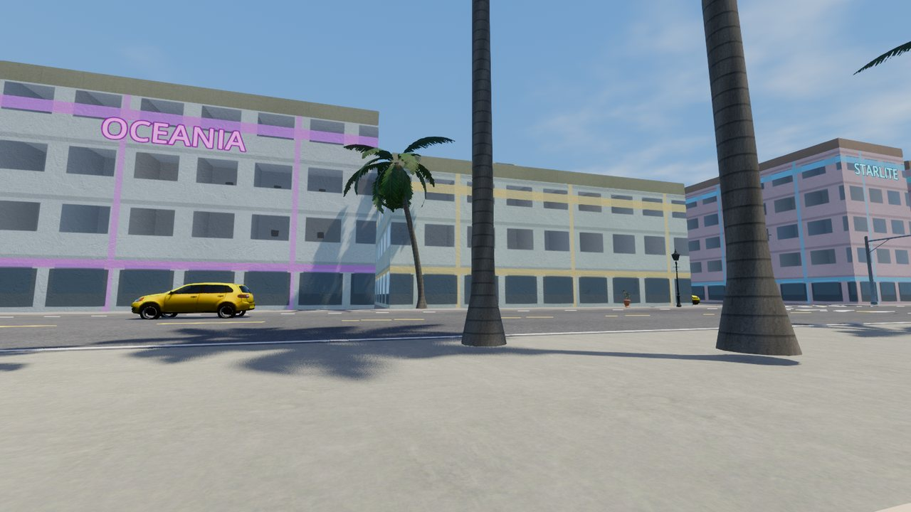
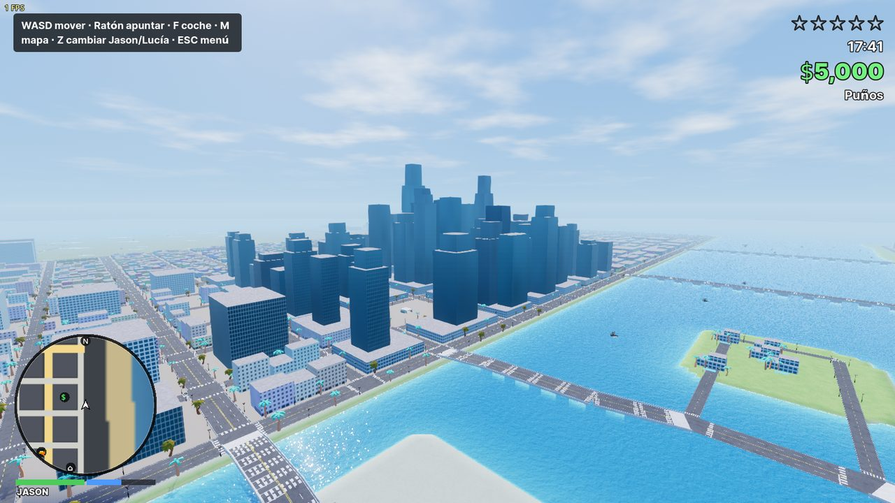
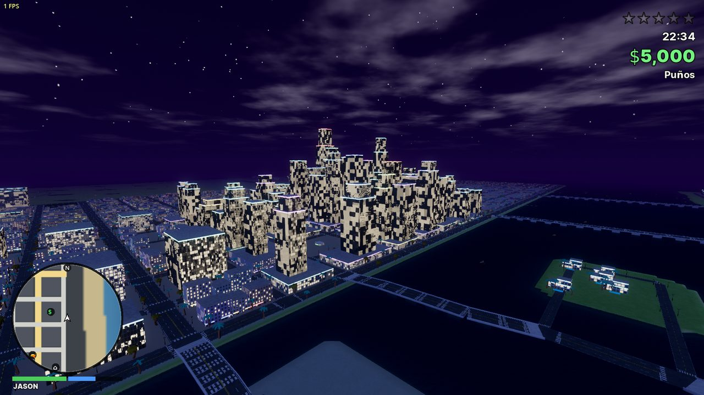
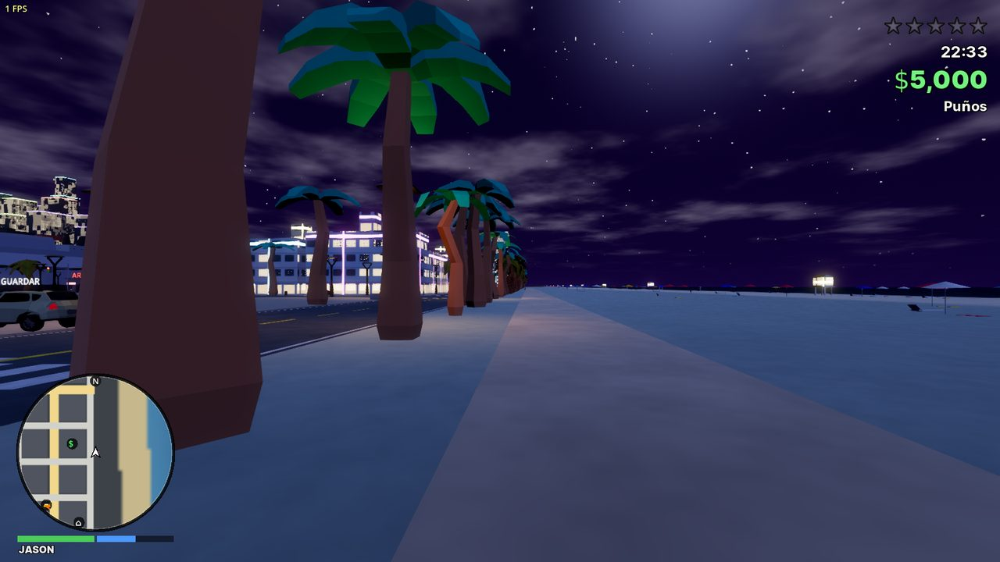
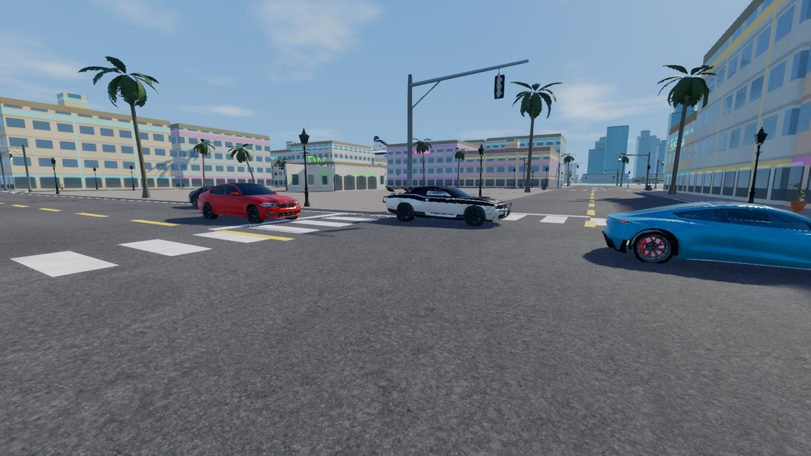
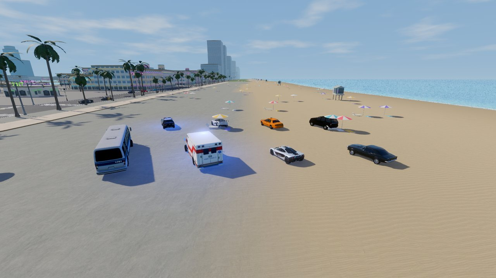
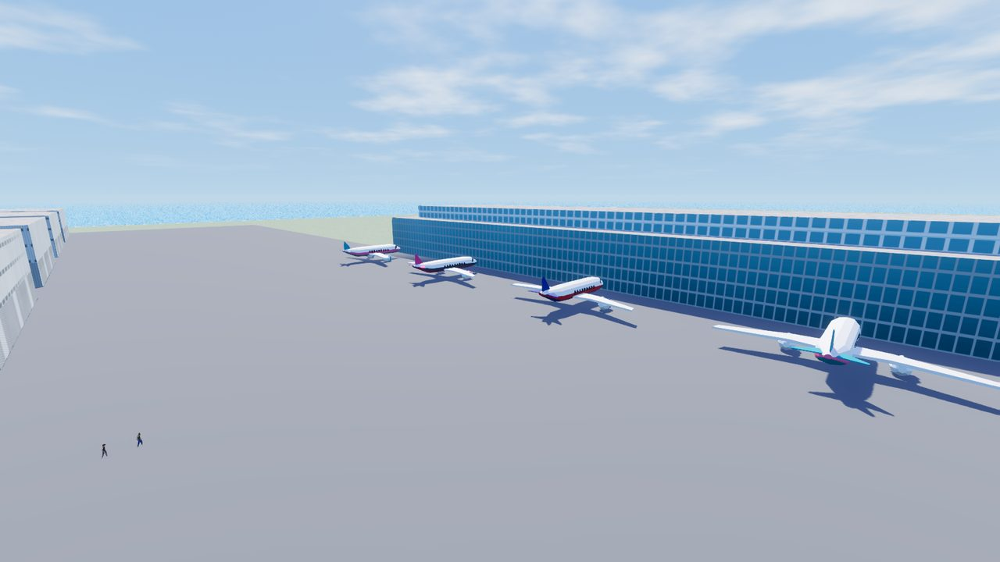
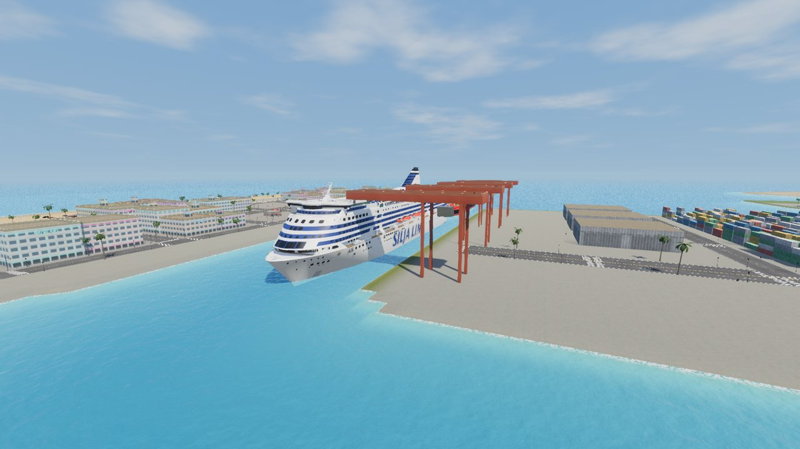

# VICE CITY · Leonida Free Roam

Réplica fan de **GTA VI** en modo **mundo libre** (sin historia) para **Windows (.exe)**, hecha con
[Godot 4.7](https://godotengine.org). Recrea Vice City y el estado de Leonida a partir de la
información pública de los tráilers (Ocean Drive, Downtown, Little Cuba/Havana, el puerto, el
aeropuerto, los Everglades/Grassrivers, los Cayos...), con Jason y Lucía como protagonistas.

> Proyecto fan **no oficial** y para **uso privado**. No contiene material filtrado ni archivos de
> Rockstar Games. Todos los modelos 3D son de terceros (ver [Créditos](#créditos-y-licencias)).



## Descargar y jugar

El juego pesa unos 200 MB comprimido, así que va dividido en 3 partes (GitHub no admite archivos
de más de 100 MB):

1. Descarga las tres partes de [`builds/`](builds): `ViceCity-Windows-x64.zip.001`, `.002` y `.003`,
   y también `UNIR_PARTES.bat`, todo en la misma carpeta.
2. Haz doble clic en `UNIR_PARTES.bat` (o abre la parte `.001` con 7-Zip/WinRAR): se crea
   `ViceCity-Windows-x64.zip`.
3. Descomprime la carpeta completa (`ViceCity.exe` y `ViceCity.pck` tienen que estar juntos) y
   ejecuta `ViceCity.exe` (Windows 10/11 de 64 bits, GPU con Vulkan o DirectX 12).
   Si SmartScreen avisa: *Más información → Ejecutar de todas formas*.

## Qué incluye

**Ciudad y mundo**
- Mapa de unos 3 × 4 km: Ocean Beach con hoteles art déco y neones, Vice Beach, Downtown con
  rascacielos, Brickell, Little Cuba, Stockyard (almacenes con grafitis), West/North Vice,
  Starfish Island y Fisher Island con mansiones, el puerto con grúas y cruceros, el aeropuerto
  internacional (terminal, aviones en las puertas, hangares), Grassrivers (pantano) y los Cayos
  con la autopista sobre el mar.
- Puentes y causeways, playas con sombrillas, socorristas y paseo marítimo, cocoteros y árboles
  realistas, farolas, bancos, papeleras, bocas de incendio y aparatos de aire acondicionado en las
  azoteas (modelos fotorrealistas de Poly Haven), 326 cruces con **semáforos que funcionan**,
  marinas con yates y veleros fondeados.
- Texturas fotográficas PBR (arena, césped, asfalto, hormigón, estuco, ladrillo, chapa) con
  relieve, iluminación con tonemapping AgX, oclusión ambiental y reflejos en pantalla.
- Ciclo día/noche (atardeceres rosados, ciudad iluminada de noche) y clima dinámico: nublado,
  lluvia y tormenta con relámpagos y calles mojadas.

**Personajes**
- Jason y Lucía, jugables e intercambiables (tecla **Z**); el otro te sigue, sube al coche y
  pelea a tu lado.
- Personajes **realistas** (modelos Mixamo): peatones, bañistas, bandas callejeras en sus barrios,
  médicos, policía y SWAT.
- Animaciones completas: andar, correr, agacharse, nadar, apuntar, recargar, puñetazos, lanzar
  granadas, caídas, entrar y salir de coches.

**Vehículos** (todos con modelos realistas)
- Coches de calle, deportivos, SUVs, taxis, furgonetas, pick-ups, camión de basura, grúa,
  autobuses, autobús escolar, ambulancias, bomberos, patrullas de la VCPD con sirenas y luces,
  yates, lanchas, veleros y remolcador.
- Coches de marcas reales: **BMW M5 CS, BMW M8, BMW M3 GTR, Dodge Challenger R/T, Tesla
  Roadster, Ferrari 599, Porsche 911 GT3 R, McLaren F1, Chevrolet Camaro y GMC Canyon**, además
  de un monster truck y un Fórmula 1 (Mercedes W14).
- **Aviones pilotables**: Cessna 172, Cessna Citation, Airbus A320 y caza Rafale, con despegue, sustentación
  y entrada en pérdida, aterrizaje con tren, choques y amerizajes. El avión vuela hacia donde
  miras con la cámara. Salta en pleno vuelo con **paracaídas** (Lucía te sigue).
- Física con suspensión, derrapes con freno de mano, daños (humo → fuego → explosión),
  gasolina, radio (VICE FM y RADIO LEONIDA), faros, claxon, robo de coches con conductor.
- Tráfico con IA que sigue los carriles, **para en los semáforos en rojo**, esquiva y huye.

**Combate y policía**
- Puños, pistola, SMG, rifle de asalto, escopeta, francotirador con mira, lanzacohetes y
  granadas, con modelos 3D, retroceso, disparos a la cabeza, blindaje y munición.
- Nivel de búsqueda de 1 a 5 estrellas: patrullas, persecuciones con A*, policía a pie, SWAT,
  zona de búsqueda en el minimapa, **¡WASTED!** y **¡BUSTED!**.

**Sistemas**
- Tiendas: gasolineras, armerías, tiendas de ropa, badulaques que se pueden atracar, Pinta
  Rápido (reparar, repintar y perder a la policía), hospitales, casas seguras para guardar.
- HUD al estilo GTA: minimapa giratorio con GPS, vida, blindaje, estrellas, dinero, arma,
  hora, nombres de zona y vehículo. Menú de pausa con mapa completo (clic para marcar destino),
  estadísticas, ajustes y controles.
- Guardar/cargar partida (F5/F9) y trucos.

## Controles

| Acción | Teclado y ratón | Mando |
|---|---|---|
| Mover / correr / andar | WASD / Shift / Alt | Stick izq. / B / — |
| Saltar / agacharse | Espacio / C | A / L3 |
| Apuntar / disparar | Clic der. / Clic izq. | LT / RT |
| Recargar / cambiar arma | R / 1-8 o rueda | X / LB-RB |
| Granada | G | — |
| Entrar / robar vehículo | F | Y |
| Interactuar (tiendas, gasolina...) | E | Cruceta → |
| Cambiar Jason ↔ Lucía | Z | Cruceta ↓ |
| Mapa / pausa | M / ESC | Back / Start |
| En coche: acelerar, frenar, girar | W / S / A-D | Stick izq. |
| Freno de mano / claxon | Espacio / H | A / R3 |
| Sirena / luces / radio / cámara | Q / L / N / V | — / — / — / Cruceta ↑ |
| Avión: potencia / dirección / alabeo | W-S / ratón / A-D | Stick izq. / cámara |
| Avión: frenos / saltar en paracaídas | Espacio / F | A / Y |
| Paracaídas: planear | WASD | Stick izq. |
| Guardar / cargar | F5 / F9 | — |
| Trucos | T | — |

**Trucos:** `DINERO`, `ARMAS`, `VIDA`, `DIOS`, `MUNICION`, `SINPOLICIA`, `POLICIA5`,
`SUPERCOCHE` (McLaren F1), `INFERNUS` (Ferrari), `DEPORTIVO` (BMW M5), `DRAGSTER` (Porsche),
`MCLAREN`, `MONSTRUO` (monster truck), `F1` (Fórmula 1), `PATRULLA`, `TAXI`, `AMBULANCIA`, `BOMBEROS`, `CAMION`, `AUTOBUS`,
`AVIONETA`, `JET`, `CAZA`, `JUMBO` (te sube a un avión de pasajeros en la pista),
`LANCHA`, `TORMENTA`, `LLUVIA`, `SOL`, `NOCHE`, `MEDIODIA`, `ATARDECER`, `RAPIDO`, `CAOS`,
`TELEPORT`.

## Capturas

| | |
|---|---|
|  |  |
|  |  |
|  |  |
|  |  |
|  | |

## Compilar desde el código

1. Instala [Godot 4.7.2](https://godotengine.org/download) y sus *export templates*.
2. Abre `game/project.godot`, o exporta por línea de comandos:
   ```
   godot --headless --path game --export-release "Windows Desktop" ../builds/ViceCity/ViceCity.exe
   ```
3. Pruebas automáticas (sin ventana): `godot --headless --path game -- --test=smoke`
   (también `traffic`, `chase`, `combat`, `fly`, `perf`).

Estructura: `game/scripts/world` (mapa, generación de la ciudad, zonas especiales, semáforos),
`actors`, `vehicles`, `combat`, `ai`, `player`, `systems` (población, policía, tiendas, radio,
trucos) y `ui`. `game/tools` contiene los scripts de prueba y los conversores de modelos.

## Créditos y licencias

- Personajes: modelos Mixamo (Adobe) publicados en proyectos de GitHub; animaciones: Quaternius
  *Universal Animation Library* 1 y 2 (CC0), retargeteadas en la importación.
- Coches, servicios y barcos: proyecto [Motorpool](https://github.com/Atul-Senapati/Motorpool)
  (exportaciones de Sketchfab) y colección [Vivekkk-1/3D-Models](https://github.com/Vivekkk-1/3D-Models)
  (Boost Software License 1.0); las marcas y diseños pertenecen a sus fabricantes.
- Aviones: [FlightAirMap-3dmodels](https://github.com/Ysurac/FlightAirMap-3dmodels) (FlightGear,
  GPL) y [FlightSim](https://github.com/vinny-palumbo/FlightSim).
- Entorno: texturas PBR de ambientCG y Poly Haven (CC0), mobiliario urbano de Poly Haven (CC0),
  árbol SpeedTree de [Babylon.js Assets](https://github.com/BabylonJS/Assets) (CC BY 4.0),
  semáforos de [Rostock 3DModels](https://github.com/rostock/3DModels) (CC0).
- Armas: AK-74 (vía [three-fps](https://github.com/mohsenheydari/three-fps)), *Free Low Poly
  Weapons Pack* de amaraha (vía Jeh3no, MIT) y *Low Poly RPG-7* de Polyte (CC-BY 4.0).
- Sonidos: Kenney (CC0). Tipografía Inter (SIL OFL).
- Grand Theft Auto, Vice City y Leonida son marcas de Take-Two Interactive / Rockstar Games.
  Este proyecto no está afiliado a ellas.

Los textos completos están en [`game/assets/licenses`](game/assets/licenses).
